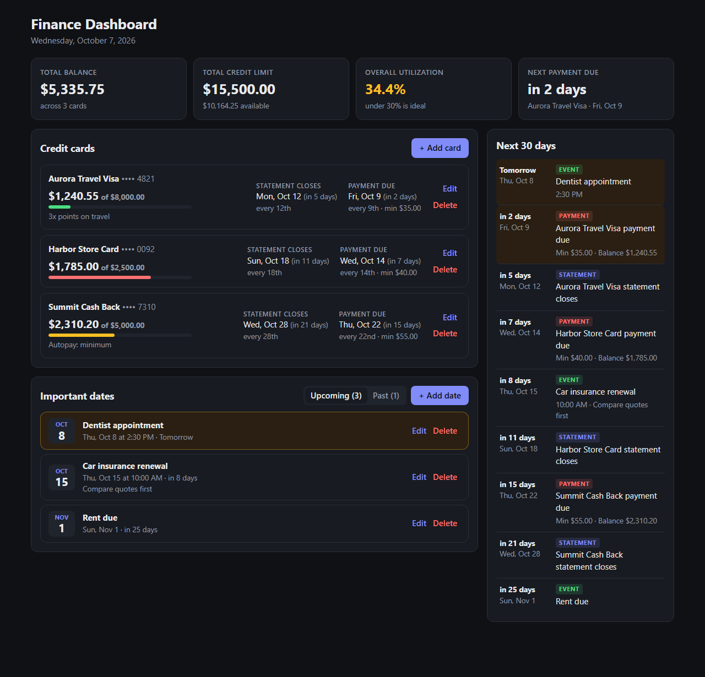

# Finance Dashboard



*Screenshot uses made-up example data.*

A local dashboard for tracking credit card balances, statement/due dates, and important dates.

Everything runs on your machine. Data is stored in `data/db.json` (git-ignored), and the
server only listens on `127.0.0.1`, so nothing is reachable from your network.

## Tech stack

- **Frontend:** React + Vite
- **Backend:** Node.js (local server on 127.0.0.1)
- **Storage:** JSON file (`data/db.json`, git-ignored)

  
## Run it

```bash
npm install     # first time only
npm run dev     # then open http://127.0.0.1:5173
```

`npm start` builds the app and serves everything from a single server at http://127.0.0.1:3001.

## Features

- **Credit cards**: balance, limit, minimum payment, and the day of the month the statement
  closes and the payment is due. Shows each card's next dates and utilization.
- **Summary**: total balance, total limit, overall utilization, and the next payment due.
- **Important dates**: anything with a date and optional time. Split into upcoming and past.
- **Next 30 days**: one timeline that combines payments, statement closings, and your dates.

## Roadmap

- [x] Manual entry for card balance, limit, and minimum payment
- [x] Combined 30-day timeline for payments, statements, and important dates
- [ ] Pull card data automatically with the Plaid API
- [ ] Demo mode with sample data, so it can be hosted publicly
- [ ] Deploy a live demo
- [ ] Mobile app version
- [ ] Performance improvements and bug fixes

